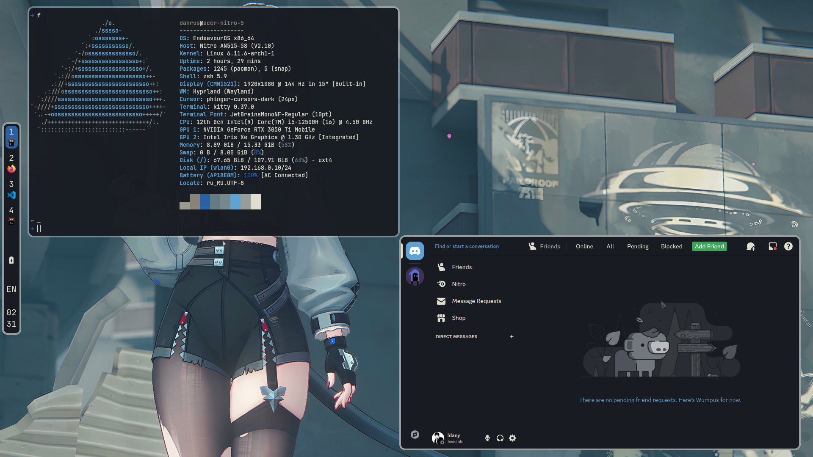
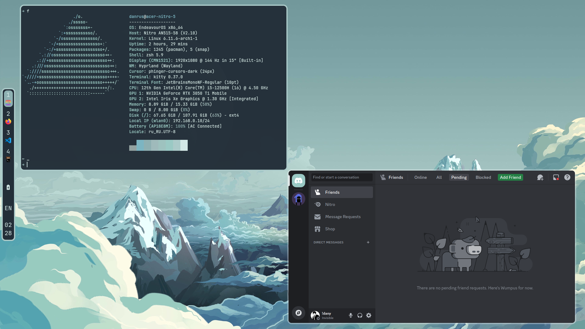
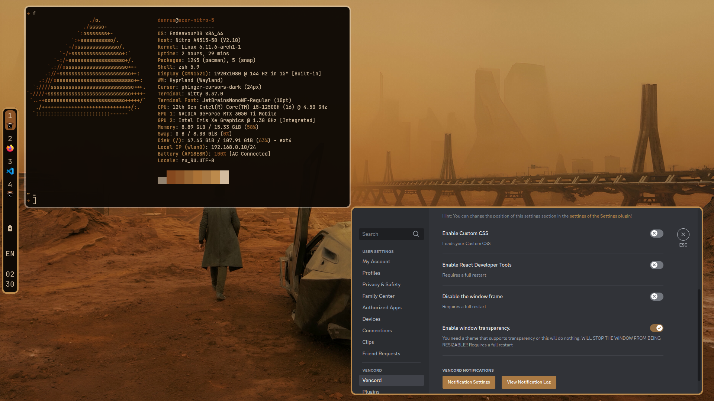
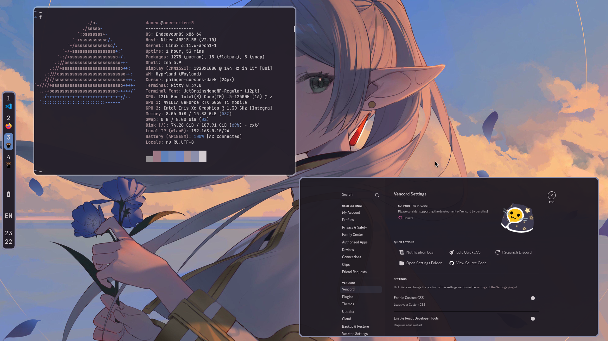

# Walcord - (Pywal)ing *every* themes for Vesktop


## How to install from [releases](https://github.com/Danrus1100/walcord/releases):
1. Download a binary file
2. copy in /usr/bin/ directory:
```bash
sudo cp <path_to>/walcord /usr/bin
walcord
```

## How to build frome source:
```bash
git clone https://github.com/Danrus1100/walcord.git
cd walcord
python -m venv .venv/
source .venv/bin/activate 
pip install -r requirements.txt --upgrade
pyinstaller walcord.spec
./dist/walcord
```


## Usage cases:

### 1. Using Default theme (easiest way)

 1. *run a `walcord` command*
 2. *select `Walcord Default Theme` in Vesktop*

### 2. Overwrite a existing theme
First, you need to prepare a theme that will be used as the basis for your theme.
To do this, [download](https://betterdiscord.app/themes) the theme, and replace the colors you want with KEY(key_name, opacity).
script will replace the KEY with the css color code in rgba format:

```css
--some-var: KEY(1, 0.5); /* will become rgba(r, g, b, 0.5) */
```
The KEY syntax will be discussed in more detail [here](#keys-syntax)

After that, you can use this theme in walcord:
```bash
walcord -t <path/to/theme>
```

### 3 Use for other applications
Walcord doesn't care what type of file is given to it, so it can be used in many places. the limit of possibilities is your imagination! to save a style file in a certain directory use `--output`:

```bash
walcord -t <path-to-some-file.txt> -o <path-and/or-name-a-new-file>
```

You can also use the image you want, from which the colors will be taken, using `--image`:
```bash
walcord -i <path-to-image>
```

## KEY's syntax

KEY() can take `background`, `foreground` and numbers from 0 to 15 as the first argument:

```css
***
--bg-3: KEY(background);
--text-3: KEY(2)
***
```
you can also set the transparency of the color from 0 to 1 and use short names:
```css
***
--accent-1: KEY(F, 0.75)
--hover: KEY(br, 1)
***
```
<details>
<summary>All names of colors and they short vesions (click me)</summary>

 - `background: b`
 - `foreground: f`
 - `border: br (color 2)`
 - `text: t (color 15)`
 - `accent: a (color 13)`
</details>

If you only want values from KEY, individual colors, or HEX format, you can use the output parameters:

```css
***
--accentcolor: KEY(a).rgb_values; /* it will become just r,g,b values*/
--foo: KEY(T).r /* it will become just r value*/
***
```
<details>
<summary>All output parameters (click me)</summary>

 - `rgba` = `rgba(r, g, b, a)`
 - `rgb` = `rgba(r, g, b)`
 - `hex` = `#RRGGBB`
 - `rgba_values` = `r,g,b,a`
 - `rgb_values` = `r,g,b`
 - `hex_values` = `RRGGBB`
 - `red / r` = `r`
 - `green / g` = `g`
 - `blue / b` = `b`
 - `opacity / o` = `a`

</details>

## Theme [examples](https://github.com/Danrus1100/walcord/tree/main/examples):

 - [Default](https://github.com/Danrus1100/walcord/blob/main/examples/recolor_dark.css):


 - [Recolor Blurple](https://github.com/Danrus1100/walcord/blob/main/examples/recolor_blurple.css):



 - [Midnight](https://github.com/Danrus1100/walcord/blob/main/examples/midnight.css):


### ToDo
- [x] `--image` optional
- [x] `--output` argument (saving a file to a specific path and name)
- [x] simple theme
- [x] `--theme` optional (use simple theme)
- [ ] windows support

### Special thanks
 - [danihek/Themecord](https://github.com/danihek/Themecord): The Ideological mastermind
