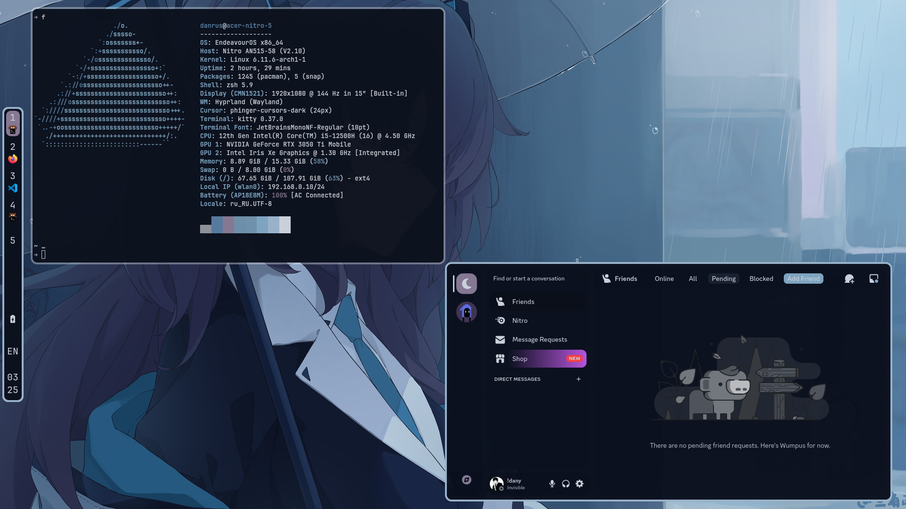

# Walcord - (Pywal)ing *every* themes for Vesktop

### How to build frome source:
```bash
git clone https://github.com/Danrus1100/walcord.git
cd walcord
python -m venv .venv/
source .venv/bin/activate 
pip install -r requirements.txt --upgrade
pyinstaller --onefile main.py -n walcord
./dist/walcord
```
### Usage
First, you need to prepare a topic that will be used as the basis for your theme.
To do this, [download](https://betterdiscord.app/themes) the theme, and replace the colors you want with KEY_<PYWAL_COLOR_NAME>. Example:
```css
***
--bg-3: KEY(background);
--text-3: KEY(2)
***
```
you can also set the transparency of the color from 0 to 1 and use short names:
```css
***
--accent-1: KEY(f, 0.75)
--hover: KEY(br, 1)
***
```
All names of colors and they short vesions:
 - **background: b**
 - **foreground: f**
 - **border: br**
 - **text: t**
 - **accent: a**


After that, you can use this theme in walcord:

```bash
./walcord -i <path/to/image> -t <path/to/theme>
```

### Theme examples (check examples folder):
 - Midnight:

